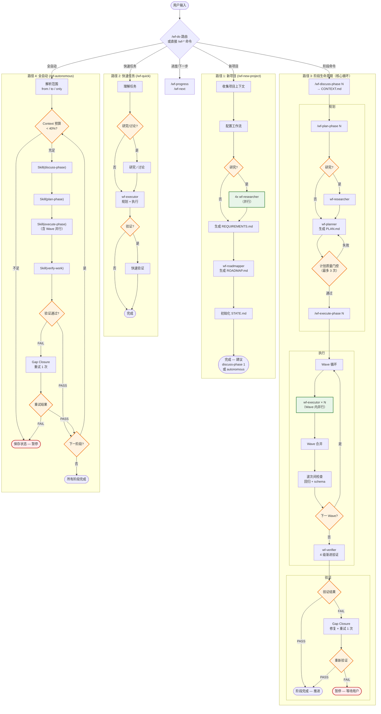

# WF 工作流系统架构

## 概述

WF 是一套 Claude Code 个人配置/插件系统，提供结构化项目管理能力：从项目初始化、需求定义、阶段规划到并行执行和验证。

- **系统定位**: Claude Code IDE 扩展，安装到项目 `.claude/` 目录后激活，无需服务器或云部署
- **核心模式**: 自然语言路由 -> Markdown 工作流引擎 -> Agent 并行执行 -> 状态追踪 -> 质量验证
- **技术栈**: Node.js (CommonJS) + Markdown + Claude Code Hooks，零外部依赖
- **版本**: 1.0.0（`wf/VERSION`）

---

## 整体执行流程

下图展示 WF 系统从用户输入到任务完成的完整执行路径。四条主路径覆盖不同场景：新项目初始化、快速任务、阶段生命周期（核心循环）、以及全自动模式。菱形节点为关键决策/门控点，标注 "并行" 的节点表示多 agent 并发执行。



### 流程要点

| 维度 | 说明 |
|------|------|
| **四条入口路径** | **新项目** — 从零初始化；**快速任务** — 轻量临时任务；**阶段生命周期** — 完整 discuss→plan→execute→verify 循环；**全自动** — 循环包裹阶段生命周期，逐阶段推进 |
| **并行化位置** | (1) 新项目研究：4 个 wf-researcher 并行；(2) 阶段执行：同一 Wave 内多个 wf-executor 并行（worktree 隔离） |
| **三个关键门控** | (1) **计划质量门控** — 最多 3 次修订循环；(2) **验证门控** — 4 级渐进验证，失败触发 gap closure（重试 1 次）；(3) **Context 预算门控** — 剩余 < 40% 时暂停，保存状态供新会话恢复 |
| **错误恢复策略** | 重试 1 次后仍失败 → 暂停并保存状态，等待用户介入。不跳过失败阶段，不无限重试 |

---

## 系统分层

WF 采用 6 层架构，从用户交互到底层状态管理逐层递进：

| 层次 | 名称 | 位置 | 核心职责 |
|------|------|------|----------|
| 1 | 命令入口层 | `commands/wf/` | 用户交互入口，16 个 slash 命令 |
| 2 | 工作流编排层 | `wf/workflows/` | 执行逻辑编排，15 个工作流定义 |
| 3 | Agent 执行层 | `agents/` | 专业化任务执行，6 个 agent |
| 4 | CLI 工具层 | `wf/bin/` | 状态操作与数据处理，12 个模块 |
| 5 | 运行时监控层 | `hooks/` | 会话监控与安全防护，4 个 hook |
| 6 | 状态与配置层 | `.planning/` | 项目状态持久化与配置管理 |

---

### 1. 命令入口层（Command Layer）

**位置**: `commands/wf/`（16 个命令定义文件）

**功能**: 用户通过 `/wf-*` slash 命令与系统交互。`do.md` 提供自然语言路由，解析用户意图后分发到具体命令。

**命令清单（16 个）**:

| 分类 | 命令 | 说明 |
|------|------|------|
| **路由** | `do` | 自然语言意图解析，路由到最匹配的命令 |
| **核心生命周期** | `new-project` | 初始化项目（PROJECT.md, REQUIREMENTS.md, ROADMAP.md, STATE.md） |
| | `discuss-phase` | 阶段讨论，生成 CONTEXT.md |
| | `plan-phase` | 阶段规划，生成 PLAN.md |
| | `execute-phase` | 阶段执行，生成 SUMMARY.md |
| | `verify-work` | 工作验证，生成 VERIFICATION.md |
| **自动化** | `autonomous` | 全自动多阶段执行（discuss->plan->execute->verify） |
| | `quick` | 快速任务（跳过完整生命周期） |
| **会话管理** | `pause` | 暂停当前工作，写入 HANDOFF.json |
| | `resume` | 恢复暂停的工作，读取 HANDOFF.json |
| | `next` | 自动判断下一步操作并路由 |
| **配置与状态** | `settings` | 查看/修改工作流配置 |
| | `progress` | 查看项目进度 |
| **质量工具** | `code-review` | 代码审查（3 层文件范围） |
| | `complete-milestone` | 完成里程碑（归档 + 重置） |
| | `new-milestone` | 创建新里程碑 |

---

### 2. 工作流编排层（Workflow Layer）

**位置**: `wf/workflows/`（15 个工作流定义）

**功能**: 以 Markdown 定义执行逻辑，通过 `Skill()` 调用链编排多步操作。工作流是系统的"大脑"，决定在什么条件下调用哪些 agent、执行哪些 CLI 命令。

**工作流清单（15 个）**:

| 工作流 | 对应命令 | 说明 |
|--------|----------|------|
| `do.md` | `do` | 意图路由逻辑 |
| `new-project.md` | `new-project` | 项目初始化流程（含 4 个并行 researcher） |
| `discuss-phase.md` | `discuss-phase` | 阶段讨论与上下文收集 |
| `plan-phase.md` | `plan-phase` | 阶段规划（含可选 research） |
| `execute-phase.md` | `execute-phase` | 阶段执行编排（并行 executor per plan） |
| `verify-work.md` | `verify-work` | 验证编排（4 级渐进验证） |
| `autonomous.md` | `autonomous` | 全自动链式执行 |
| `quick.md` | `quick` | 快速任务流程 |
| `progress.md` | `progress` | 进度展示 |
| `next.md` | `next` | 下一步路由 |
| `session.md` | _(无对应命令)_ | 会话管理内部逻辑 |
| `settings.md` | `settings` | 配置管理流程 |
| `code-review.md` | `code-review` | 代码审查流程 |
| `complete-milestone.md` | `complete-milestone` | 里程碑完成流程 |
| `new-milestone.md` | `new-milestone` | 新里程碑创建流程 |

**映射关系**: 命令与工作流大部分 1:1 对应。`session.md` 是唯一没有对应命令入口的工作流，作为内部会话管理逻辑使用。`pause` 和 `resume` 命令共用 session 工作流的不同分支。

**Skill() 链式调用模式**: 工作流通过 `Skill()` 引用其他工作流实现组合。以 `autonomous.md` 为例：

```
autonomous.md
  -> Skill(discuss-phase.md)    // 收集上下文
  -> Skill(plan-phase.md)       // 生成计划
  -> Skill(execute-phase.md)    // 执行计划
  -> Skill(verify-work.md)      // 验证结果
```

---

### 3. Agent 执行层（Agent Layer）

**位置**: `agents/`（6 个 agent 定义文件）

**功能**: 专业化的任务执行单元，由工作流层通过 Task/Agent 工具调用。每个 agent 有明确的职责边界和输入/输出合同。

**Agent 清单（6 个）**:

| Agent | 职责 | 触发场景 | 默认模型 |
|-------|------|----------|----------|
| `wf-executor` | 执行计划中的任务，逐 task 提交 | execute-phase（并行，每个 PLAN 一个） | sonnet |
| `wf-planner` | 生成阶段计划（PLAN.md） | plan-phase | sonnet |
| `wf-verifier` | 4 级渐进验证 | execute-phase（完成后）、verify-work | sonnet |
| `wf-researcher` | 代码分析、技术调研 | new-project（4 并行）、discuss-phase、plan-phase | haiku |
| `wf-roadmapper` | 生成/更新路线图 | new-project | haiku |
| `wf-reviewer` | 代码审查 | code-review | sonnet |

**合同机制**: 所有 agent 输出遵循统一的 JSON 完成标记格式：

```json
{
  "status": "complete|failed|blocked",
  "artifacts": ["created/modified file paths"],
  "summary": "execution summary"
}
```

工作流 orchestrator 解析 `status` 字段决定后续路由。

**重试规则**: 失败后最多重试 1 次，第二次失败立即停止，防止无限循环。

**模型配置**: 通过 `config.json` 的 `agents.models` 节配置，支持按 agent 指定模型：
- 执行/规划/验证/审查类 -> sonnet（需要精确编码能力）
- 研究/路线图类 -> haiku（轻量级，成本优化）

---

### 4. CLI 工具层（CLI Tool Layer）

**位置**: `wf/bin/wf-tools.cjs`（路由器，77 行）+ `wf/bin/lib/`（12 个功能模块）

**功能**: 提供状态管理、配置操作、进度计算等底层数据操作能力。由 hook 脚本和 agent 通过命令行调用。

**路由器**: `wf-tools.cjs` 使用 switch-case 模式将命令分发到对应模块：

```
wf-tools [--cwd <path>] <command> [subcommand] [args...]

命令路由：
  init        -> init.cjs
  state       -> state.cjs
  roadmap     -> roadmap.cjs
  phase       -> phase.cjs
  phase-ops   -> phase.cjs
  progress    -> progress.cjs
  commit      -> git.cjs
  config      -> config.cjs
  settings    -> config.cjs
  validate    -> validate.cjs
  session     -> session.cjs
  review      -> review.cjs
  milestone   -> milestone.cjs
```

**模块依赖图**:

```
utils.cjs (121 行) -- 基础层，无内部依赖，所有模块共同依赖
  |
  |-- state.cjs (507 行)      -- YAML frontmatter CRUD，STATE.md 读写
  |-- config.cjs (257 行)     -- 配置读写，深度合并
  |-- roadmap.cjs (354 行)    -- 阶段管理（增删改查）
  |-- session.cjs (223 行)    -- HANDOFF.json 持久化
  |-- validate.cjs (169 行)   -- 健康检查
  |-- milestone.cjs (187 行)  -- 里程碑归档与重置
  |-- git.cjs (87 行)         -- Git 提交操作 (+ execFileSync)
  |
  |-- phase.cjs (176 行)      -- 阶段目录定位
  |     |
  |     |-- progress.cjs (76 行)  -- 进度计算 (依赖 phase)
  |     |-- init.cjs (177 行)     -- 初始化操作 (依赖 config + phase)
  |     +-- review.cjs (316 行)   -- 代码审查 (依赖 phase + execFileSync)
  |
  +-- (共 12 个模块)
```

**模块导出函数清单**:

| 模块 | 行数 | 主要导出 |
|------|------|----------|
| `utils.cjs` | 121 | `readFile`, `readJson`, `writeFile`, `ensurePlanningDir`, `findProjectRoot`, `output`, `error` |
| `config.cjs` | 257 | `loadConfig`, `CONFIG_DEFAULTS`, `deepMerge`, `saveConfig`, `getConfigSchema`, `getConfigValue`, `run` |
| `state.cjs` | 507 | `parseFrontmatter`, `serializeFrontmatter`, `parseYamlValue`, `parseStateMd`, `stateGet/Set/Json/Patch/Merge/Validate/BeginPhase/AdvancePlan`, `run` |
| `roadmap.cjs` | 354 | `roadmapAnalyze`, `addPhase`, `insertPhase`, `removePhase`, `run` |
| `phase.cjs` | 176 | `findPhaseDir`, `phaseInfo`, `run` |
| `progress.cjs` | 76 | `calculateProgress`, `run` |
| `git.cjs` | 87 | `gitCommitPlanning`, `run` |
| `init.cjs` | 177 | `run`, `initPhaseOp`, `initNewProject`, `initQuick` |
| `validate.cjs` | 169 | `validateHealth`, `validateFormat`, `run` |
| `session.cjs` | 223 | `createHandoff`, `readHandoff`, `deleteHandoff`, `generateContinueHere`, `run` |
| `review.cjs` | 316 | `computeFileScope`, `extractKeyFilesFromSummaries`, `getGitDiffFiles`, `filterReviewFiles`, `parseReviewFrontmatter`, `run` |
| `milestone.cjs` | 187 | `archiveMilestone`, `resetForNewMilestone`, `run` |

---

### 5. 运行时监控层（Runtime Layer）

**位置**: `hooks/`（4 个 hook 脚本）+ `settings.json`（hook 绑定配置）

**功能**: 在 Claude Code 会话生命周期的关键节点注入监控、防护和状态展示能力。

**Hook 清单（4 个）**:

| Hook | 文件 | 行数 | 触发时机 | 超时 | 功能 |
|------|------|------|----------|------|------|
| 会话初始化 | `wf-session-state.js` | 227 | SessionStart | 默认 | Node.js 会话初始化，创建 bridge file |
| Context 监控 | `wf-context-monitor.js` | 117 | PostToolUse (Bash\|Edit\|Write\|MultiEdit\|Agent\|Task) | 10s | Context 预算监控和消耗警告 |
| Prompt 防护 | `wf-prompt-guard.js` | 92 | PreToolUse (Write\|Edit) | 5s | 输入内容安全过滤 |
| 状态栏 | `wf-statusline.js` | 91 | StatusLine | 默认 | 状态栏显示（进度条 + context 使用率） |

> 注：`wf-session-state.sh`（22 行）是原始 bash 版本，已被 `.js` 版本替代，保留为遗留文件。

**Hook 数据流**:

```
settings.json 定义绑定
  -> Claude Code 在对应事件触发 hook
    -> hook 从 stdin 读取 JSON（包含 session metrics、tool input 等）
      -> hook 处理逻辑
        -> 通过 stdout 返回 JSON（hookSpecificOutput）
```

**Context 预算监控机制**:

| 阈值 | 剩余 Context | 行为 |
|------|-------------|------|
| WARNING | <= 35% | 注入黄色警告提示 |
| CRITICAL | <= 25% | 注入红色紧急提示，建议保存状态 |
| Debounce | 每 5 次调用 | 防止警告刷屏 |

**Prompt Guard 机制**:
- 负向前瞻模式检测：识别已知的 prompt 注入模式
- 注入模式匹配：`INJECTION_PATTERNS` 常量定义检测规则
- 触发时阻止写入并返回警告

**SessionStart 初始化流程**:
1. 读取 Claude Code 会话元数据
2. 创建 bridge file（写入 `/tmp`）
3. 检查 HANDOFF.json 是否存在（会话恢复场景）
4. 初始化会话状态指标

**StatusLine 状态栏显示**:
- 进度条：基于 STATE.md 计算（Unicode 块字符 filled/empty）
- Context 使用率：从 session metrics 读取

---

### 6. 状态与配置层（State & Config Layer）

**位置**: `.planning/` 目录结构

**功能**: 项目状态的唯一数据源。所有层通过此目录读写项目元数据、阶段产物、执行状态和配置。

**STATE.md 结构**:
- YAML frontmatter：结构化状态数据（版本、进度、里程碑等）
- Markdown body：人类可读的状态描述（决策、待办、阻塞项等）
- 支持嵌套 dotted-key CRUD 操作（如 `progress.completed_plans`）

**config.json 配置项分类**:

| 配置节 | 说明 |
|--------|------|
| `mode` | 工作模式（autonomous/interactive） |
| `workflow` | 工作流行为（research 开关等） |
| `planning` | 规划参数 |
| `parallelization` | 并行化设置（max_concurrent_agents, min_plans_for_parallel） |
| `gates` | 质量门控配置（硬门控/软门控） |
| `safety` | 安全规则 |
| `hooks` | Hook 行为配置 |
| `agents` | Agent 配置（models 节指定各 agent 使用的模型） |

**目录结构**:

```
.planning/
  PROJECT.md              # 项目定义（需求、约束、技术栈）
  REQUIREMENTS.md         # 需求清单与追踪
  ROADMAP.md              # 路线图（阶段列表、依赖关系）
  STATE.md                # 执行状态（当前位置、进度、决策记录）
  config.json             # 工作流行为配置
  phases/
    {NN}-{slug}/          # 每阶段子目录
      {NN}-CONTEXT.md         # 阶段上下文（discuss-phase 产出）
      {NN}-RESEARCH.md        # 研究报告（可选，plan-phase 产出）
      {NN}-{NN}-PLAN.md       # 执行计划（plan-phase 产出）
      {NN}-{NN}-SUMMARY.md    # 执行摘要（execute-phase 产出）
      {NN}-VERIFICATION.md    # 验证报告（verify-work 产出）
```

---

## 数据流

### 项目生命周期数据流

项目从创建到验证的完整数据流，每个阶段产出特定的 Markdown 产物：

```
new-project
  -> PROJECT.md, REQUIREMENTS.md, ROADMAP.md, STATE.md, config.json

discuss-phase N
  -> phases/{NN}-{slug}/{NN}-CONTEXT.md

plan-phase N
  -> phases/{NN}-{slug}/{NN}-{NN}-PLAN.md
  -> phases/{NN}-{slug}/{NN}-RESEARCH.md  (可选)

execute-phase N
  -> phases/{NN}-{slug}/{NN}-{NN}-SUMMARY.md  (per plan)
  -> 代码文件变更 + git commits

verify-work
  -> phases/{NN}-{slug}/{NN}-VERIFICATION.md
```

### 会话数据流

跨会话的状态持久化机制：

```
SessionStart hook
  -> 创建 bridge file (/tmp)
  -> context-monitor 读取 bridge file 获取会话元数据

pause 命令
  -> 写入 HANDOFF.json（当前任务、进度、上下文摘要）

resume 命令
  -> 读取 HANDOFF.json -> 恢复执行上下文 -> 删除 HANDOFF.json

next 命令
  -> 读取 STATE.md -> 判断当前位置 -> Skill() 路由到正确的工作流
```

### 质量工具数据流

独立于生命周期的质量保证工具：

```
code-review
  -> REVIEW.md（3 层文件范围：phase / milestone / full）
  -> 范围计算：review.cjs 的 computeFileScope + filterReviewFiles

complete-milestone
  -> 归档 phases/ 目录到 milestone 存档
  -> 重置 STATE.md 为新里程碑初始状态

new-milestone
  -> 创建新的 milestone 目录结构
  -> 初始化新的 phases/ 目录
```

---

## 关键设计模式

### Markdown-as-Code

工作流和 agent 指令以 Markdown 定义，而非传统编程语言代码：

- **工作流定义**: `wf/workflows/*.md` 用自然语言描述执行逻辑
- **Agent 指令**: `agents/wf-*.md` 用 Markdown + YAML frontmatter 定义 agent 能力
- **YAML frontmatter**: 作为结构化元数据载体（name, description, tools, references）
- **Skill() 组合**: 工作流通过 `Skill()` 引用其他工作流，实现类似函数调用的组合

### 合同驱动的 Agent 交互

Agent 间通过统一的 JSON 完成标记通信：

- 所有 agent 产出遵循 `{ status, artifacts, summary }` 格式
- 工作流 orchestrator 解析 `status` 字段决定后续路由
- `complete` -> 继续下一步
- `failed` -> 重试（最多 1 次）或停止
- `blocked` -> 暂停，等待人工干预
- 合同定义文档：`wf/references/agent-contracts.md`

### 质量门控（Gates）

可配置的质量检查点，在关键节点验证工作质量：

| 门控类型 | 行为 | 重试 |
|----------|------|------|
| 硬门控（hard） | 必须通过才能继续 | 最多 3 次 |
| 软门控（soft） | 仅发出警告 | 不重试 |

门控通过 `config.json` 的 `gates` 节配置。定义文档：`wf/references/gates.md`。

### Wave 并行化

任务按 Wave 分组，Wave 内并行执行，Wave 间按依赖顺序串行：

```
Wave 1: [Task 1.1] [Task 1.2] [Task 1.3]  <-- 并行执行
         |
Wave 2: [Task 2.1] [Task 2.2]              <-- 依赖 Wave 1 完成
         |
Wave 3: [Task 3.1]                          <-- 依赖 Wave 2 完成
```

配置项：
- `parallelization.max_concurrent_agents`: 最大并行 agent 数
- `parallelization.min_plans_for_parallel`: 触发并行的最小 plan 数

### 渐进式验证

4 级递进验证，从文件存在到端到端数据流通：

| 级别 | 名称 | 验证内容 |
|------|------|----------|
| 1 | EXISTS | 文件是否存在 |
| 2 | SUBSTANTIVE | 是否有真实实现（非空壳/占位符） |
| 3 | WIRED | 是否正确集成到系统中 |
| 4 | DATA-FLOWING | 端到端数据流是否畅通 |

各级别失败触发 gap closure：生成修复计划 -> 执行修复 -> 重新验证（仅一次）。

定义文档：`wf/references/verification-patterns.md`。

---

## 安装结构

WF 系统从源码仓库安装到目标项目的 `.claude/` 目录：

```
源码仓库                              目标项目
  commands/wf/      --复制-->      .claude/commands/wf/
  agents/           --复制-->      .claude/agents/
  hooks/            --复制-->      .claude/hooks/
  wf/               --复制-->      .claude/wf/
  settings.json     --复制-->      .claude/settings.json
  VERSION           --复制-->      .claude/wf/VERSION
```

- 命令文件中的 `{{WF_ROOT}}` 占位符在安装时替换为 `$HOME/.claude`
- `settings.json` 复制到 `.claude/settings.json` 后自动激活 hooks
- 安装后无需编译或构建步骤

---

## 参考文档索引

| 文件 | 用途 |
|------|------|
| `wf/references/agent-contracts.md` | Agent 输入/输出合同定义 |
| `wf/references/gates.md` | 质量门控规则和配置 |
| `wf/references/verification-patterns.md` | 4 级渐进验证模式定义 |
| `wf/references/ui-brand.md` | UI 输出规范（ANSI 颜色、进度条格式） |
| `wf/references/anti-patterns.md` | Prompt 注入防护模式库 |
| `wf/references/context-budget.md` | Context 预算管理策略 |
| `wf/references/continuation-format.md` | 跨会话延续格式定义 |

---

## 模板索引

| 文件 | 用途 |
|------|------|
| `wf/templates/config.json` | 工作流配置模板（初始化时复制到 `.planning/config.json`） |
| `wf/templates/project.md` | PROJECT.md 模板 |
| `wf/templates/requirements.md` | REQUIREMENTS.md 模板 |
| `wf/templates/roadmap.md` | ROADMAP.md 模板 |
| `wf/templates/state.md` | STATE.md 模板 |

---

## 测试

- **框架**: `node:test` + `node:assert`（Node.js 内置，零外部依赖）
- **测试文件**: 11 个（`wf/bin/lib/` 内 10 个 `*.test.cjs` + `hooks/` 内 1 个 `wf-prompt-guard.test.cjs`）
- **组织方式**: 测试文件与模块同目录放置
- **运行命令**: `node --test wf/bin/lib/*.test.cjs hooks/*.test.cjs`

---

## 错误处理策略

WF 系统在不同层次采用不同的错误处理策略：

| 场景 | 策略 |
|------|------|
| Executor 执行中发现 bug | 立即修复，记录到 commit message 和 SUMMARY.md |
| Plan 质量门控失败 | 最多 3 次修订循环，重新生成 PLAN.md |
| Verification 任意级别失败 | 生成 gap closure 计划 -> 执行修复 -> 重新验证（仅一次） |
| 外部依赖阻塞 | 暂停并记录原因，等待人工干预 |
| 发现需要架构变更 | 立即暂停（executor 不得自行决定架构变更） |
| Context 预算紧张 | 注入警告，建议保存状态，提供会话检查点 |
| Hook 脚本异常 | 静默失败（exit 0），不阻塞 Claude Code 主流程 |
