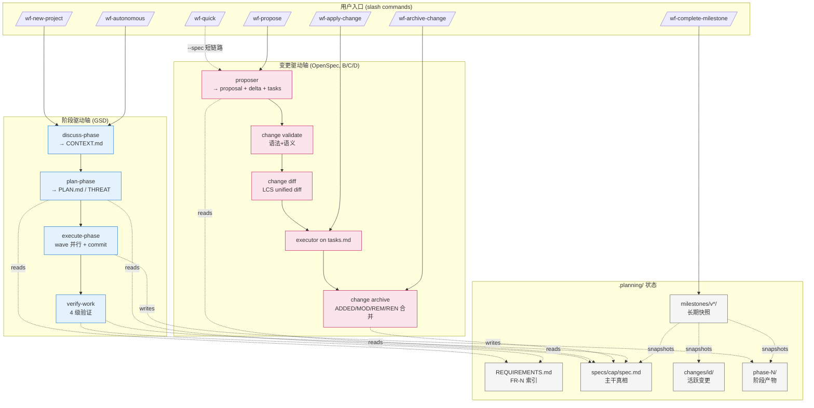

# WF 工作流程图

> 本文给出 WF 的分层架构、两条主流程（阶段驱动 / 变更驱动）、两轴交汇点，
> 以及后续优化建议。所有图都是文本形式，方便在任何编辑器里标注。

## 1. 整体架构分层

```
┌── L6 语义触发层 (Phase E) ─────────────────────────────────────┐
│  wf/skills/wf-*/SKILL.md       25 个 Claude Code 官方 Skill    │
│  - 9 开放自动触发（description 驱动）                           │
│  - 12 受控触发（disable-model-invocation: true）                │
│  - 4 后台知识（user-invocable: false）                          │
│  - 1 个 context: fork（wf-code-review）                         │
│  - commands/wf/ 已全量清空，全部命令由 skill 提供               │
│  - P0 收敛：wf-next + wf-progress → wf-status                   │
└───────────────────────────────────┬────────────────────────────┘
                                    │ @ include
┌── L4 工作流主体 ────────────────────▼──────────────────────────┐
│  wf/workflows/*.md            16 个 workflow（LLM 解读执行）   │
│  new-project / discuss-phase / plan-phase / execute-phase /    │
│  verify-work / autonomous / quick / propose / ...              │
└───────────────────────────────────┬────────────────────────────┘
                                    │ Agent() / Skill()
┌── L3 Sub-Agents ───────────────────▼──────────────────────────┐
│  planner · executor · verifier · researcher · roadmapper ·    │
│  reviewer · proposer (B)                                       │
│  （executor 在 worktree 隔离并行，其余共享主 context）          │
└───────────────────────────────────┬────────────────────────────┘
                                    │ shell exec
┌── L2 权威状态 CLI ──────────────────▼──────────────────────────┐
│  wf/bin/wf-tools.cjs → lib/*.cjs                               │
│  state · roadmap · phase · milestone · config · session ·      │
│  validate · progress · review · spec (A) · change (B/D)        │
└───────────────────────────────────┬────────────────────────────┘
                                    │ fs 读写
┌── L1 单一事实源 ────────────────────▼──────────────────────────┐
│  .planning/                                                    │
│  ├── PROJECT.md (跨里程碑常驻宪法)                             │
│  ├── REQUIREMENTS.md · ROADMAP.md · STATE.md · config.json     │
│  ├── phase-N/ {CONTEXT, PLAN*, SUMMARY*, VERIFICATION, REVIEW} │
│  ├── specs/<cap>/spec.md          ← Phase A                    │
│  ├── changes/<id>/ + archive/     ← Phase B                    │
│  ├── milestones/v*/ (含 specs + changes-archive 快照) ← C     │
│  ├── CONTINUATION.md (autonomous 检查点，临时)                 │
│  └── HANDOFF.json  (pause/resume 检查点)                       │
└───────────────────────────────────┬────────────────────────────┘
                                    │ watched by
┌── L0 运行时 Hooks ──────────────────▼──────────────────────────┐
│  SessionStart → wf-session-state.js   注入项目状态、恢复检查点 │
│  PreToolUse   → wf-prompt-guard.js    扫 .planning/ 注入模式   │
│  PostToolUse  → wf-context-monitor.js 30%/15% 预算告警         │
│  StatusLine   → wf-statusline.js      WF │ 模型 │ 任务 │ 进度  │
└────────────────────────────────────────────────────────────────┘
```

## 2. 阶段驱动主流程（Phase-driven）

```
/wf-new-project
  │
  ├─ researcher ×4 并行  (tech / features / arch / risks)
  ├─ roadmapper ×1  → ROADMAP.md
  │                  └─ [spec.enabled] specs/<cap>/spec.md 初始骨架
  └─ → PROJECT / REQUIREMENTS / STATE / config.json
       │
       ▼
/wf-autonomous --from N    (或手动链式)
  │
  └─ for N in [from..to]:
       │
       ├─ /wf-discuss-phase N
       │    └─ researcher ×0-N (顾问研究，可选)
       │       → phase-N/CONTEXT.md（含 Decisions + Discussion Log 附录）
       │
       ├─ /wf-plan-phase N
       │    ├─ researcher ×1  (实现研究，可选)
       │    └─ planner ×1   (最多 3 次修订门禁)
       │       → phase-N/{PLAN*, THREAT-MODEL?}.md
       │
       ├─ /wf-execute-phase N                     ┌── 核心并行 ──┐
       │    ├─ 文件冲突预检 (depends_on × files_modified)         │
       │    ├─ for wave:                                          │
       │    │    └─ executor ×N  worktree 隔离并行 ───────────────┤
       │    │         → SUMMARY*.md + 每任务一 commit             │
       │    └─ verifier ×1   4 级验证 (EXISTS→SUBSTANTIVE         │
       │         → VERIFICATION.md                 →WIRED→DATA)   │
       │         └─ FAIL → gap closure (1 次) → re-verify         │
       │                                          └──────────────┘
       └─ /wf-verify-work (对话式 UAT)
            └─ verifier + reviewer(可选)
               → UAT.md + REVIEW.md?
  │
  ▼
/wf-complete-milestone v1.0
  └─ 归档 phases + REQUIREMENTS/ROADMAP/STATE
     + specs/ 快照               ← Phase C
     + changes/archive/ 快照     ← Phase C
     → milestones/v1.0/
  │
  ▼
/wf-new-milestone v1.1
  └─ 保留 PROJECT + config + specs/ + 活跃 changes/
     清空 REQUIREMENTS + ROADMAP + phases/
```

## 3. 变更驱动主流程（Change-driven，Phase B/C/D）

```
/wf-propose <idea>
  │
  ├─ proposer ×1  (读 specs/ 快照 + idea)
  │  → changes/<id>/
  │     ├─ proposal.md           Why + What + Capabilities + Impact
  │     ├─ tasks.md              实现 checkbox
  │     ├─ design.md?            可选（跨 capability 技术决策）
  │     └─ specs/<cap>/spec.md   delta
  │        └─ ## ADDED / MODIFIED / REMOVED / RENAMED Requirements
  │
  └─ 自动 change validate
       │
       ▼
/wf-validate-spec <id>              （手改后重跑）
  └─ wf-tools change validate
     ├─ delta 语法校验
     └─ 与主 spec 的语义一致性（id 优先，header 次之）
       │
       ▼
wf-tools change diff <id>           ← Phase D-1（unified diff 预览）
  └─ LCS 行级 +/- 输出，不修改任何文件
       │
       ▼
/wf-apply-change <id>
  └─ executor ×1 按 tasks.md 实现代码
     → 逐任务 commit
       │
       ▼
/wf-archive-change <id>  [--dry-run]
  └─ wf-tools change archive
     ├─ applyDeltaToSpec(master, delta)      fail-fast 合并
     │  ├─ ADDED    → 追加到 Requirements 段末
     │  ├─ MODIFIED → id/header 匹配，整块替换
     │  ├─ REMOVED  → id/header 匹配，删除
     │  └─ RENAMED  → 改 header，body 可选；支持 - From: @id:<id>
     ├─ 写回 specs/<cap>/spec.md
     └─ mv changes/<id>/ → changes/archive/YYYY-MM-DD-<id>/
```

## 4. 两轴交汇点

```
                阶段驱动轴                         变更驱动轴
              (GSD / 时间维度)                  (OpenSpec / 内容维度)
                     │                                   │
                     │       共享 .planning/              │
                     │                                   │
               ┌─────▼─────┐                 ┌──────────▼─────────┐
               │  phase-N/ │  REQUIREMENTS   │  specs/<cap>/      │
               │   PLAN    │  ←── 互引 ──→   │    spec.md 主干    │
               │  SUMMARY  │  FR-N ↔ 需求    │  changes/<id>/     │
               │  VERIFY   │                 │    delta.md        │
               └───────────┘                 └────────────────────┘
                     │                                   │
                     ▼                                   ▼
              按阶段交付                           按规格治理
                     │                                   │
                     └────────┬──────────────────────────┘
                              │
                              ▼
                      /wf-quick --spec
                      (小特性走 propose→apply→archive 短链路)

                      /wf-complete-milestone
                      (同时快照两轴产物到 milestones/v*/)

                      wf-tools spec coverage <FR-N|header|cap|id>
                      (D-3 反向追踪：给一个 id 查 6 类源)
```

## 5. 同一张图（Mermaid，GitHub/Notion/Mermaid Live 渲染）



## 6. 优化清单（按"改动量小 / 收益大"排序）

| 优先级 | 点 | 现状 → 优化方向 |
|---|---|---|
| 🔥 高 | **`/wf-quick --spec` 独立 workflow 化** | 目前是 `quick.md` 里的条件分支 step，应拆成独立 `wf/workflows/quick-spec.md`，避免 quick 文件越长越稀释专注度 |
| 🔥 高 | **change apply 与 phase 的关系形式化** | 现在 `/wf-apply-change` 独立跑 executor，丢失了 phase 的 wave / conflict-check / worktree 基础设施。可以让一个 change 生成"mini-phase"（只有一个 PLAN.md）复用全部执行机制 |
| 🔥 高 | **coverage 结果按 source 分组 + 去重** | 当前按扫描顺序输出，信息量大时难读；按 `source` 分组，相同 FR 在 PLAN/SUMMARY 同时命中时合并 |
| 中 | **proposer 和 planner 合并为双模式** | 两个 agent 只差输出契约（spec delta vs PLAN.md），prompt 参数切换即可，减少 agent 文件维护成本 |
| 中 | **`change diff --html`** | 输出带样式的 HTML 片段便于粘到 PR 评论（LCS 脚本已有，只差一个 renderer） |
| 中 | **Hook 层的 change 感知** | `wf-session-state.js` 目前只看 phase 推断 step，可同时识别活跃 changes 给出 "3 个 change 待 archive" 这类提示 |
| 低 | **statusline 显示当前 change** | 若项目正在 propose/apply 某 change，statusline 应能替代阶段显示为 `change:add-oauth · 4/7 tasks` |
| 低 | **requirement ID 的格式校验** | 目前 `[A-Za-z0-9._-]`；可约束为 `<CAP>-<NUMBER>` 风格（如 `AUTH-001`）促使命名一致 |
| 观察 | **phase-N 与 change 的追溯字段** | PLAN.md 的 `must_haves` 可以要求带 `FR-N` 或 req-id 列表，让 coverage 追溯从"文本搜索"升级为"结构化索引" |

---

> 本文档与 `ARCHITECTURE.md`、`README.md` 同步更新。
> 原始讨论见 `/Users/zxs/.claude/plans/project-claude-peaceful-bengio.md`。

---

## 7. Phase E — Skill 层全景

```
                        用户输入
                           │
                 ┌─────────┴─────────┐
                 │                   │
          自然语言/语义         显式 /wf-xxx
                 │                   │
                 ▼                   ▼
        ┌───────────────────────────────────┐
        │  Claude Code Runtime (Skill 发现)  │
        │                                   │
        │  读取所有 SKILL.md 的 description  │
        │  ↓                                │
        │  语义匹配 → 激活对应 skill         │
        └──────────────┬────────────────────┘
                       │
        ┌──────────────┴───────────────────┐
        │                                   │
   开放触发 skill (12)                受控/后台 skill (14)
        │                                   │
   立即执行 body                  disable: 用户显式时才激活
                                 user-invocable:false: Claude 参考但不出菜单
        │                                   │
        └──────────────┬───────────────────┘
                       │
                       ▼
            @ 引用 workflow/reference body
                       │
                       ▼
              展开到传统 L4 (workflow) / L3 (agent) / L2 (CLI)
```

### 25 个 Skill 分类（P0 收敛后）

| 类别 | Skills |
|---|---|
| 命令型 · 开放触发 | wf-status（含查询 + --auto-advance）/ wf-quick / wf-verify-work / wf-propose / wf-apply-change / wf-validate-spec / wf-code-review (+ context: fork) |
| 命令型 · 受控触发 | wf-new-project / wf-discuss-phase / wf-plan-phase / wf-execute-phase / wf-autonomous / wf-complete-milestone / wf-archive-change / wf-new-milestone / wf-do（意图路由）/ wf-pause / wf-resume / wf-settings |
| Reference 型 · 开放触发 | wf-troubleshooting / wf-git-conventions（仅 .planning/ 存在时） |
| Reference 型 · 后台 | wf-gates / wf-worktree-lifecycle / wf-4-level-verification / wf-anti-patterns |

### Phase E + P0 对用户的可见变化

- "项目进度怎么样" → 自动触发 `wf-status`（查询模式）
- "下一步做什么" → 自动触发 `wf-status` 并进入推进模式（旧 `/wf-next`）
- "帮我改个 bug" → 自动加载 `wf-quick`
- 在 WF 项目写 git commit → 自动加载 `wf-git-conventions`（非 WF 仓库不触发）
- "CONTINUATION.md 损坏了" → 自动加载 `wf-troubleshooting`
- 显式 `/wf-new-project` / `/wf-autonomous` 等行为与今日完全一致
